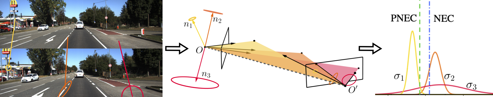

<h2 align="center">The Probabilistic Normal Epipolar Constraint for Frame-To-Frame Rotation Optimization under Uncertain Feature Positions</h2>

<p align="center">
    <a href="https://vision.in.tum.de/members/muhled">Dominik Muhle</a><sup>1*</sup> &emsp;
    <a href="https://lukaskoestler.com">Lukas Koestler</a><sup>1*</sup> &emsp;
    <a href="https://vision.in.tum.de/members/demmeln">Nikolaus Demmel</a><sup>1</sup> &emsp;
    <a href="http://florianbernard.net/">Florian Bernard</a><sup>2</sup> &emsp;
    <a href="https://vision.in.tum.de/members/cremers">Daniel Cremers</a><sup>1</sup>
</p>

<p align="center">
    <sup>*</sup>equal contribution&emsp;&emsp;&emsp;
</p>

<p align="center">
    <sup>1</sup>Technical University of Munich&emsp;&emsp;&emsp;
    <sup>2</sup>University of Bonn<br>
</p>

<p align="center">
    IEEE / CVF Conference on Computer Vision and Pattern Recognition (CVPR) 2022, New Orleans, USA
</p>
<p align="center">
    <a href="https://arxiv.org/abs/2204.02256">arXiv</a> |
    <a href="https://go.vision.in.tum.de/pnec">Project Page</a>
</p>



This project provides code for the Probabilistic Normal Epipolar Constraint (PNEC). The PNEC is an extension of the NEC that incorporates uncertainty information to provide more accurate frame-to-frame rotation estimation. This repository allows for the evaluation of the PNEC on real-world data (the KITTI dataset) as an odometry system and on simulated data.
The Code in this repository is influenced by [Monocular Rotational Odometry](https://github.com/ckchng/MRO) (MRO) by Chng et al. and adapted for the PNEC. Please check out their work as well. Due to the usage of KLT-tracks instead of ORB-features, rotation averaging and loop closure are disabled.


## Installation
### Docker
For easy usage a dockerfile is included that installs all dependencies and the PNEC. An example usage is given below.

### Dependencies
Tested on:
* SuiteSparse\
  ```sudo apt-get install libsuitesparse-dev```

* Ceres Solver \
  <http://ceres-solver.org/installation.html> provides a guide on how to install the ceres solver
  Ceres is dependent on
  * Eigen 3.3
  * glog 0.3.5
  * gflags
  * SuiteSparse 4.0
  * etc.

* opencv 4.0.0 \
  <https://www.pyimagesearch.com/2018/05/28/ubuntu-18-04-how-to-install-opencv/> provides a good guide.

* Boost (Filesystem) 1.6.5\
  ```sudo apt-get install libboost-all-dev```

* opengv 1.0.0\
  (refer to the [official site](https://laurentkneip.github.io/opengv/) for potential installation FAQs)\
  opengv is included in basalt and therefore does not need to be installed directly

* basalt [gitlab](https://gitlab.com/VladyslavUsenko/basalt/-/tree/master/) \
  Also includes Eigen 3.4, opengv, Sophus and others using git submodules
  * clone into ```third_party/basalt``` with git submodules \
    ```git clone --recursive https://gitlab.com/VladyslavUsenko/basalt.git```
  * follow their instructions to install

## Installing PNEC
Go to the root directory
```
  mkdir build
  cd build
  cmake ..
  make
```

### pybind
We provide a pybind of the pose optimization and the KLT-feature extraction methods.

## Usage
### Simple Patch extraction
Run localy:

set directory of the seqences and outputs in the ```uncertainty_extraction.sh``` file.
Run
```
./uncertainty_extraction.sh "sequence_name"
```
TODO: patch extraction on the target frame based on VO system (no rotation of patch uncertainty)

### Example in a docker container
1. Build the docker image
2. Create the container \
```docker run -i -d --name pnec --mount type=bind,source=path_to_kitti,target=/home/sequences --mount type=bind,source=path_to_results,target=/home/results pnec:latest```
3. Run the ```kitti_docker.sh``` script
```docker exec pnec /bin/sh -c "/app/kitti_docker.sh -s sequence"```

### The KITTI dataset
The following provides an example of how to run the VO algorithm on the KITTI dataset. 
#### data format
The VO algorithm expects the images to be in the ``ìmage_2`` directory of the ``XX`` sequence. This directory should also include a ``times.txt`` containing timestamps in seconds and a ``XX.txt`` containing the ground truth poses as 3x4 transformation matrices, which is then copied to the respective results folder.
#### config files
Config files for the PNEC for the diffent KITTI sequences are provided in ```./data/``` and config files for tracking are provided in ```./data/tracking/```. If you want to run KITTI with other configurations change them here.
#### run sequences
In order to run PNEC on KITTI you can use ```parallel_kitti.sh```. It allows you to specify which sequences you want to run how many iterations of each sequence you want to run in parallel. The different iterations are saved in incremental order starting from the provided starting value
```
./parallel_kitti.sh -d dataset_path -r results_path -s number_of_first_iteration -i number_of_iterations
```
#### evaluation
There are different evaluations provided
* method evlauation: evaluate a single method over the different runs of selected sequences.
```
python3 ./scrips/method_evaluation.py -d directory -m method_name -s sequences
```
* sequence evaluation: evaluate selected methods over the differnet runs of a single sequence
```
python3 ./scripts/sequence_evaluation.py -d directory -s sequence -m method_names 
```
* dataset evaluation: evaluate selected methods over all runs of all sequences, present aggregated results
```
python3 ./scripts/dataset_evaluation.py -d directory -m method_names
```
:heavy_exclamation_mark: You need to provide each script with the location of the ground truth.
### simulated data
Evaluating the PNEC on simulated data consists of generating the problems, running the experiments, and evaluating the results. There are currently 4 different experiments implemented:
* standard: experiments over different noise levels
* anisotropy: experiments over different levels in the anisotropy of the noise
* offset: experiments that provide the PNEC with wrongly estimated noise parameters
* outlier: experiments over different percentages of outlier

All experiments can be done for omnidirectional and pinhole cameras. Additionally, the relative pose can have a random translation or no translation at all. Except for the anisotropy experiments, different noise types can be used for noise generation. See the paper and supplementary material for more details.

#### problem generation
The problems can be either generated by hand or by using ```create_experiment.sh```
```
./create_experiments.sh -d directory -e experiment_number -n number_of_experiments
```
where you provide the base directory for the experiment storage, the experiment number (0 standard, 1 anisotropy, 2 offset, 3 outlier), and the number of experiments. The range of levels for which you want to do the experiments can be changed in create_sim_experiments.cc file. The range of levels you want the experiments generated for can be changed in the file itself.

:heavy_exclamation_mark: Warning: the experiments can take up a lot of space (e.g. 10 000 experiments ca. 15MB) for all noise types and camera types this adds up.
#### problem solving
The problems can be either generated by hand or using the create_experiment.sh script
```
./run_simulation.sh -d directory -e experiment_number -n name -m use_essential_matrix_methods -a use_ablation_methods
```
where you provide the base directory for the experiment storage, the experiment number (0 standard, 1 anisotropy, 2 offset, 3 outlier), the name of the folder for the results, if you want to solve the problems with essential matrix based methods as well, and if you want to use ablation methods. The range of levels you want the experiments solved for can be changed in the file itself.

#### evaluation
The results can be evaluated using
```
python3 ./scripts/simulation_evaluation.py -p directory -e experiment_number -n name
```
See the previous section for parameter details.

## Licence
The code is provided under a BSD 3-clause license. See the LICENSE file for details.
Note also the different licenses for thirdparty submodules.
